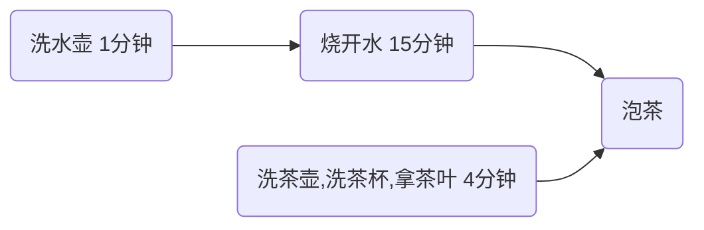
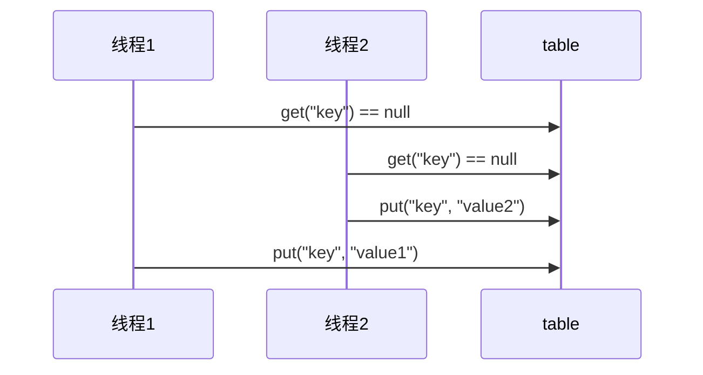

# JUC 并发编程

> JUC是 在Java 5.0添加的 java.util.concurrent包的简称，目的就是为了更好的支持[高并发](https://so.csdn.net/so/search?q=高并发&spm=1001.2101.3001.7020)任务，
>
> 让开发者利用这个包进行的[多线程](https://so.csdn.net/so/search?q=多线程&spm=1001.2101.3001.7020)编程时可以有效的减少竞争条件和死锁线程

## 1. 进程与线程

### 1.1 进程与线程

#### 进程

- 程序由指令和数据组成，但这些指令要运行，数据要读写，就必须将指令加载至CPU，数据加载至内存。在指令运行过程中还需要用到磁盘、网络等设备。进程就是用来加载指令、管理内存、管理IO的
- 当一个程序被运行，从磁盘加载这个程序的代码至内存，这时就开启了一个进程
- 进程就可以视为程序的一个实例。大部分程序可以用来同时运行多个实例进程（例如：记事本、画图、浏览器等），也有的程序只能启动一个实例进程（例如：网易云音乐、360安全卫士等）

#### 线程

- 一个进程之内可以分为一到 多个线程
- 一个线程就是一个指令流，将指令流中的一条条指令以一定顺序交给 CPU执行
- java中，线程作为最小调度单位，进程作为资源分配的最小单位。在 windows中进程是不活动的，只是作为线程的容器

#### 二者对比

- 进程基本上相互独立的，而线程存在于进程内，是进程的一个子集
- 进程拥有共享的资源，如内存空间等，供其内部的线程共享
- 进程间通信较为复杂
  - 同一台计算机的进程通信称为 IPC(Inter-process communication)
  - 不同计算机之间的进程通信，需要通过网络，并遵守共同的协议，例如 http
- 线程通信相对简单，因为它们共享进程内的内存，一个例子是多个线程可以访问同一个共享变量
- 线程更轻量，线程上下文切换成本一般上要比进程上下文切换低

### 1.2 并行与并发

单核cpu下，线程实际还是**串行执行**的。操作系统中有一个组件叫做任务调度器，将cpu的时间片（windows下时间片最小约为15毫秒）分给不同的线程使用，只是由于 cpu在线程间（时间片很短）的切换非常快，人类感觉是同时运行的。总结就是：**微观串行，宏观并行**

一般将*这种线程轮流使用 cpu*的做法称为**并发** (**concurrent**)

| CPU  | 时间片1 | 时间片2 | 时间片3 | 时间片4 |
| ---- | ------- | ------- | ------- | ------- |
| core | 线程1   | 线程2   | 线程3   | 线程4   |


多核cpu下，每个核（core）都可以调度运行线程，这时候线程可以是并行的

| CPU   | 时间片1 | 时间片2 | 时间片3 | 时间片4 |
| ----- | ------- | ------- | ------- | ------- |
| core1 | 线程1   | 线程1   | 线程3   | 线程3   |
| core2 | 线程2   | 线程4   | 线程2   | 线程4   |


引用 Rob Pike的一段描述：

- 并发（concurrent）是同一时间应对（dealing with）多件事件的能力
- 并行（parallel）是同一时间动手做（doing）多件事件的能力

### 1.3 应用

#### 应用之异步调用（案例一）

从方法的调用角度来讲，如果

- 需要等待结果返回，才能继续运行就是**同步**
- 不需要等待结果返回，就能继续执行就是**异步**

注意：同步在多线程中还有另外一层意思，是让多个线程步调一致

##### 1）设计

多线程可以让方法执行变成异步的，比如说读取磁盘文件时，假设读取操作花费了5秒，如果没有线程调度机制，这5秒调用者什么都做不了，其代码都得暂停

##### 2）结论

- 比如在项目中，视频文件需要转换格式等操作比较费时，这时开一个新线程处理视频转换，避免阻塞主线程
- tomcat的异步 servlet也是类似的目的，让用户线程处理耗时较长的操作，避免阻塞 tomcat的工作线程
- ui程序中，开线程进行其它操作，避免阻塞ui线程

#### 应用之提高效率（案例一）

充分利用多核 cpu的优势，提高运行效率。执行3个计算，最后将计算结果汇总

```
计算 1花费 10ms
计算 2花费 11ms
计算 3花费 9ms
汇总需要 1ms
```

- 如果串行执行，那么总花费时间是 10 + 11 + 9 + 1 = 31ms

- 如果是四核 cpu，各个核心分别使用线程1执行计算1，线程2执行计算2，线程3执行计算3，那么3个线程是并行的，花费时间只取决于最长的那个线程运行时间，即 11ms，最后加上汇总时间总共是 12ms

  > 注意：需要在多核cpu才能合格提高效率，单核仍然是轮流执行

##### 1）设计

- 使用 **JMH**

##### 2）结论

1. 单核 cpu下，多线程不能实际提高程序运行效率，只是为了能够在不同的任务之间切换，不同线程流程使用cpu，不至于一个线程总占用cpu，别的线程没法干活
2. 多核 cpu可以并行跑多个线程，但能否提高程序运行效率还是要分情况的
   - 有些任务，经过精心设计，将任务拆分，并行执行，当然可以提高程序的运行效率。但不是所有计算任务都能拆分（参考【阿姆达尔定律】）
   - 也不是所有任务都需要拆分，任务的目的如果不同，谈拆分和效率则没有意义
3. IO操作不占用cpu，只是我们一般拷贝文件使用的是【阻塞IO】，这时相当于线程虽然不用 cpu，但需要一直等待 IO结束，没能充分利用线程。所有才有后面的【非阻塞IO】和【异步IO】优化

## 2. Java线程

### 2.1 创建和运行线程

#### 方法一：直接使用Thread

```java
// 1. 创建线程对象，匿名类
Thread t = new Thread() {
  @Override
  public void run() {
    // 要执行的任务
  }
}

// 2.调用线程
t.setName("t1"); // 可选，为线程设置名称
t.start();

/**
  * 例子：打印
  */
public class Test1 {
  public static void mian(String[] args) {
    Thread t1 = new Thread() {
      @Override
      public void run() {
        System.out.println("hello from thread 1");
      }
    }
    t1.setName("t1");
    t1.start();
    System.out.println("hello from main");
  }
}
// 输出：
// "hello from thread 1"
// "hello from main"
```

#### 方法二：使用Runnable配合Thread

把【线程】和【任务】（要执行的代码）分开

- Thread代表线程
- Runnable可运行的任务

```java
// 1. 创建 Runable实例
// 1.1 匿名类方式
Runnable runnable = new Runnable() {
  @Override
  public void run () {
    // 要执行的任务
  }
}
// 1.2 lambda方式
Runnable runnable = () -> {
  // 要执行的任务
};
// 2. 创建 Thread实例，二参可选，为线程的名称
Thread t = new Thread(runnable, [name]);
// 3. 启动线程
t.start();

/**
  * 例子：打印
  */
public class Test2 {
  public static void mian(String[] args) {
    Runnable r1 = new Runnable() {
      @Override
      public void run() {
        System.out.println("hello from thread 2");
      }
    }
    Thread t2 = new Thread(r1, "t2");
    t2.start();

    System.out.println("hello from main");
  }
}
// 输出：
// "hello from thread 2"
// "hello from main"
```

> @FunctionalInterface注解
>
> 只有一个抽象方法的接口会拥有该注解，比如：Runnable接口
>
> 拥有该注解的接口可以使用 lambda表达式实现

#### *原理之 Thread与 Runnable的关系

**Runnable源码**

runnable方式实际会在`new Thread`时被 init方法赋值给 target变量，最后在 run方法中判断 target是否存在，存在则调用` target.run()`

**小结**

- 方法1是把线程和任务合并在一起，方法2是把线程和任务分开了
- 用 Runnable更容易与线程池等高级API配合
- 用 Runnable让任务类脱离了 Thread继承体系，更灵活

#### 方法三：FutureTask配合Thread

FutureTask能够接收 Callable类型的参数，用来处理有返回结果的情况

```java
// 创建任务对象
FutureTask<Integer> task1 = new FutureTask<>(() -> {
  System.out.println("hello from thread 3");
  // 主线程会等待 task运行结束
  Thread.sleep(2000);
  return 100;
});

// 参数 1是任务对象，参数 2是线程名称
new Thread(task1, "t3");

// 主线程阻塞，同步等待 task执行完毕的结果
Integer result = task1.get();
log.debug("结果是 {}", result);

// 输出：
// "hello from thread 3"
// 结果是 100
```

### 2.2 观察多个线程同时运行

- 交替执行
- 谁先谁后执行，由cpu任务调度控制

### 2.3 查看进程线程的方法

#### windows

- 任务管理器可以查看进程和线程数，也可以用来杀死进程
- `tasklist`查看进程
- `taskkill /F /PID <pid>`杀死进程

#### linux

- `ps -fe`查看所有进程
- `ps -fT -p <pid>`查看某个进程（PID）的所有线程
- `kill <pid>`杀死进程
- `top`按大写 H切换是否显示线程
- `top -H -p <pid>`查看某个进程（PID）的所有线程

#### Java

- `jps`命令查看所有 Java进程

- `jstack <pid>`查看某个java进程（PID）的所有线程状态（只是某个时刻的快照）

- `jconsole`来查看某个 java进程中线程的运行情况（图形化界面）

  - 远程监控需要配置

    1. 需要以如下方式运行 java类

       ```shell
       java -Djava.rmi.server.hostname=ip地址 \
       	-Dcom.sun.management.jmxremote \
       	-Dcom.sun.management.jmxremote.port=连接端口 \
       	-Dcom.sun.management.jmxremote.ssl=是否安全连接 \ # true或 false
       	-Dcom.sun.management.jmxremote.authenticate=是否认证 \ # true或 false
       	java类
       ```

    2. 修改 /etc/hosts文件将 127.0.0.1映射至主机名

  - 如果要认证访问，还需要做如下步骤
    1. 复制 jmxremote.password文件
    2. 修改 jmxremote.password和 jmxremote.access文件的权限为 600，即文件所有者可读写
    3. 连接时填入 controlRole(用户名)，R&D(密码)

### 2.4 *原理之线程运行

#### 栈与栈帧

Java Virtual Machine Stacks（Java虚拟机栈）

JVM中由堆、栈、方法区所组成，其中栈内存是线程在使用，每个线程启动后，虚拟机都会为其分配一块栈内存

- 每个栈由多个栈帧（Frame）组成，对应着每次方法调用时所占用的内存
- 每个线程只能有一个活动帧，对应着当前正在执行的那个方法


#### 线程上下文切换（Thread Context Switch）

因为以下原因导致cpu不再执行当前的线程，转而执行另一个线程的代码

- 线程的cpu时间片用完
- 垃圾回收
- 有更高优先级的线程需要运行
- 线程自己调用了 sleep、yield、wait、join、park、synchronized、lock等方法程序

当Context switch发生时，需要由操作系统保存当前线程的状态，并恢复另一个线程的状态，Java中对应的概念就是程序计数器（Program Counter Register），它的作用是记住下一条jvm指令的执行地址，是线程私有的

- 状态包括程序计数器、虚拟机栈中每个栈帧的信息，如局部变量、操作数栈、返回地址等
- Context switch频繁发生会影响性能

### 2.5 常见方法

| 方法名 static           | 功能说明                                                     | 注意                                                         |
| ----------------------- | ------------------------------------------------------------ | ------------------------------------------------------------ |
| start()                 | 启动一个新线程，在新线程运行 run方法中的代码                 | start方法只是让线程进入就绪，里面代码不一定立马运行（cpu的时间片还没分给它）。每个线程对象的start方法只能调用一次，多次调用则会 IllegalThreadStateException |
| run()                   | 新线程启动后会调用的方法                                     | 如果在构造Thread对象时传递了Runnable参数，则线程启动后会调用Runnable中的run方法，否则默认不执行任何操作。但可以创建Thread的子类对象，来覆盖默认行为 |
| join()                  | 等待线程运行结束                                             |                                                              |
| join(long n)            | 等待线程运行结束，最多等待 n毫秒                             |                                                              |
| getId()                 | 获取线程长整型的id                                           | id唯一                                                       |
| getName()               | 获取线程名                                                   |                                                              |
| setName(String)         | 设置线程名                                                   |                                                              |
| getPriority()           | 获取线程优先级                                               |                                                              |
| setPriority(int)        | 设置线程优先级                                               | java中线程优先级为1~10的整数，较大的优先级能提高被cpu调度的几率 |
| getState()              | 获取线程状态                                                 | Java中线程状态是用6个enum表示，分别是NEW,RUNNABLE,BLOCKED,WAITING,TIMED_WAITING,TERMINATED |
| isInterrupted()         | 判断是否被打断,获取打断标记                                  | 不会清除**打断标记**                                         |
| isAlive()               | 线程是否存活（还没有运行完毕）                               |                                                              |
| interrupt()             | 打断线程                                                     | 如果被打断线程正在 sleep，wait，join会导致被打断的线程抛出 InterruptedException，并清除**打断标记**。如果打断的正在运行的线程，则会设置**打断标记**。park的线程被打断，也会设置**打断标记** |
| interrupted()  static   | 判断当前线程是否被打断                                       | 会清除**打断标记**                                           |
| currentThread()  static | 获取当前正在执行的线程                                       |                                                              |
| sleep(long n)  static   | 让当前执行的线程休眠n毫秒，休眠时间内让出 cpu时间片给其它线程 |                                                              |
| yield()  static         | 提示线程调度器让出当前线程对cpu的使用                        | 主要是为了测试和调试                                         |

### 2.6 start与run

#### 调用 run

不调用`thread.start()`，直接调用 `thread.run()`方法，线程内的代码会在 main线程中运行，而不是在新建的线程中执行

#### 调用 start

- 在 `thread.start()`运行前后，`thread.getState()`分别输出**NEW**,**RUNNABLE**
- 重复多次调用同一个线程的 `thread.start()`，会抛出IllegalThreadStateException

### 2.7 yield与 sleep

#### sleep

- 调用 `sleep`会让当前线程从**Runnable**进入 **Timed Waiting**阻塞状态
- 其它线程可以使用 `interrupt`方法打断正在睡眠的线程，这时 `sleep`方法会抛出InterruptedException
- 睡眠结束后的线程未必会立刻得到执行
- 建议用 `TimeUnit`的 `sleep`方法(如：`TimeUnit.SECONDS.sleep(1)`)代替 `Thread`的 `sleep`来获得更好的可读性

#### yield

- 调用 `yield`会让当前线程从**Running**进入**Runnable**就绪状态，然后调度执行其它同优先级的线程。如果这时没有同优先级的线程，那么不能保证让当前线程展厅的效果
- 具体的实现依赖于操作系统的任务调度器

#### 线程优先级

- 线程优先级会提示（hint）调度器优先调度该线程，但它仅仅是一个提示，调度器可以忽略它
- 如果cpu比较忙，那么优先级高的线程会获得更多的时间片，但 cpu闲时，优先级几乎无作用

#### 案例-防止cpu占用100%

在没有利用 cput来计算时，不要让 while(true)空转浪费cpu，这时可以使用 yield或 sleep来让出 cpu的使用权给其它程序

```java
while(true) {
  try {
    Thread.sleep(50);
  } catch(InterruptedException e) {
    e.printStackTrace();
  }
}
```

- 使用 wait和条件变量也能达到类似效果
- 但需要加锁
- sleep适用于无需锁同步的场景

### 2.8 join方法详解

#### 为什么需要 join

下面代码要执行，r输出多少

```java
public class Test3 {
  static int r = 0;
  public static void main(String[] args) throws InterruptedException {
    test1();
  }
  private static void test1() throws InterruptedException {
    System.out.println("开始");
    Thread t1 = new Thread(() -> {
      System.out.println("开始");
      Thread.sleep(1000);
      System.out.println("结束");
      r = 10;
    }, "t1");
    t1.start();
    t1.join(); // 加 join语句，等到t1线程运行结束后，再运行后续代码
    System.out.println("结果为:{}", r);
    System.out.println("结束");
  }
}
```

分析：

- 因为主线程和线程t1是并行执行的，t1线程需要1秒后才能算出 r=10
- 而主线程一开始就要打印r的结果，所以只能打印出 r=0

解决方法：

- 用sleep行不行？为什么？
- 用join，加在t1.start()之后即可

#### *应用之同步（案例一）

以调用方角度来讲，如果

- 需要等待结果返回，才能继续运行就是**同步**
- 不需要等待结果返回，就能继续运行就是**异步**

```java
public class Test4 {
  static int r1 = 0;
  static int r2 = 0;
  public static void main(String[] args) throws InterruptedException {
    test1();
  }
  private static void test1() throws InterruptedException {
    Thread t1 = new Thread(() -> {
      Thread.sleep(1000);
      r1 = 10;
    }, "t1");
    Thread t2 = new Thread(() -> {
      Thread.sleep(2000);
      r2 = 20;
    }, "t2");
    long start = System.currentTimeMills();
    System.out.println("join start");
    t1.start();
    t2.start();
    t1.join();
    System.out.println("t1 join end");
    t2.join();
    System.out.println("t2 join end");
    long end = System.currentTimeMills();
    System.out.println("r1:{},r2:{},cost:{}", r1, r2, end - start);
  }
}
```

分析：

- 第一个join：等待 t1时，t2并没有停止，而是在运行
- 第二个join：1s后，执行到此，2也运行了1s，因此也只需要等待 1s
- 如果颠倒两个join的顺序，总用时还是2s，两个线程同时运行，只是看最长的运行时间

#### 有时效的join

```java
public class Test5 {
  static int r1 = 0;
  public static void main(String[] args) throws InterruptedException {
    test1();
  }
  private static void test1() throws InterruptedException {
    Thread t1 = new Thread(() -> {
      Thread.sleep(3000);
      r1 = 10;
    }, "t1");
    long start = System.currentTimeMills();
    System.out.println("join start");
    t1.start();
    t1.join(1500); // 有时效的 join
    long end = System.currentTimeMills();
    System.out.println("r1:{},cost:{}", r1, end - start);
  }
}
```

### 2.9 interrupt方法详解

#### 打断 sleep, wait, join的线程

```java
public class Test6 {
  public static void main(String[] args) throws InterruptedException {
    test1();
  }
  private static void test1() throws InterruptedException {
    Thread t1 = new Thread(() -> {
      Thread.sleep(3000);
      System.out.println("t1 end");
    }, "t1");
    t1.start();
    Thread.sleep(1000);
    t1.interrupt(); // 线程 t1被打断
    System.out.println("打断标记:{}", t1.isInterrupted());
  }
}
```

打断阻塞状态的线程，会抛出 InterruptedException，isInterrupted（打断标记）会被置为 false，停止当前线程程序

#### 打断正常运行的线程

```java
public class Test7 {
  public static void main(String[] args) throws InterruptedException {
    test1();
  }
  private static void test1() throws InterruptedException {
    Thread t1 = new Thread(() -> {
      while(true) {
        // 在线程中获取打断标记，自定义处理逻辑
        boolean interrupted = Thread.currentThread().isInterrupted();
        if (interrupted) {
          System.out.println("t1被打断了，退出循环");
          break;
        }
      }
    }, "t1");
    t1.start();
    Thread.sleep(1000);
    t1.interrupt(); // 线程 t1被打断
    System.out.println("打断标记:{}", t1.isInterrupted());
  }
}
```

打断正常的线程，不会停止当前线程程序，当前线程可以判断打断标记，自行决定后续操作

#### 打断 park的线程

`park()`方法会停止当前线程的运行

```java
public class Test8 {
  public static void main(String[] args) throws InterruptedException {
    test1();
  }
  private static void test1() throws InterruptedException {
    Thread t1 = new Thread(() -> {
      System.out.println("park...");
      LockSuppert.park();
      System.out.println("unpark...");
      // 打断标记为真，park失效
      // 使用 interrupted会清除打断标记，park会重新生效
      System.out.println("打断状态：{}", Thread.interrupted());
      LockSuppert.park();
      System.out.println("unpark...");
    }, "t1");
    t1.start();
    Thread.sleep(1000);
    t1.interrupt(); // 线程 t1被打断
  }
}
```

### 2.10 不推荐的方法

还有一些不推荐使用的方法，这些方法已过时，容易破坏同步代码块，造成线程死锁

| 方法名    | static | 功能说明             |
| --------- | ------ | -------------------- |
| stop()    |        | 停止线程运行         |
| suspend() |        | 挂起（暂停）线程运行 |
| resume()  |        | 恢复线程运行         |

### 2.11 主线程和守护线程

默认情况下，Java进程需要等待所有线程都运行结束，才会结束。有一种特殊的线程叫做守护线程，只要其它线程运行结束了，即使守护线程的代码没有执行完成，也会强制结束

```java
System.out.println("main start...");
Thread t1 = new Thread(() -> {
  System.out.println("thread start...");
  Thread.sleep(2000);
  System.out.println("thread end...");
}, "daemon");
// 设置该线程为守护线程
t1.setDaemon(true);
t1.start();

Thread.sleep(1000);
System.out.println("main end...");

// 输出
// [main] c.TestDaemon - main start...
// [daemon] c.TestDaemon - thread start...
// [main] c.TestDaemon - main end...
```

注意：

- 垃圾回收器就是一种守护线程
- Tomcat中的 Acceptor和 Poller线程都是守护线程，所以 Tomcat接收到 shutdown命令后，不会等待它们处理完当前请求

### 2.12 五种状态

这是从**操作系统**层面来描述


- 初始状态：仅是在语言层面创建了线程对象，还未与操作系统线程关联
- 可运行状态：（就绪状态）指该线程已经被创建（与操作系统线程关联），可以由cpu调度执行
- 运行状态：指获取了cpu时间片运行中的状态
  - 当 cpu时间片用完，会从**运行状态**转换至**可运行状态**，会导致线程的上下文切换

- 阻塞状态：
  - 如果调用了阻塞api，如bio读写文件，这时该线程实际不会用到cpu，会导致线程上下文切换，进入**阻塞状态**
  - 等bio操作完毕，会有操作系统唤醒阻塞的线程，转换至**可运行状态**
  - 与**可运行状态**的区别是，对**阻塞状态**的线程来说只要它们一直不唤醒，调度器就一直不会考虑调度它们
- 终止状态：表示线程已经执行完毕，生命周期已经结束，不会再转换为其它线程

### 2.13 六种状态

从 Java API层面来描述，根据 Thread.State枚举，分为六种状态


- NEW：线程刚被创建，但还没有调用 start()方法
- RUNNABLE：当调用了 start()方法之后，注意，java api层面的 RUNNABLE状态包含了操作系统层面的**可运行状态**，**运行状态**和**阻塞状态**（由bio导致的线程阻塞，在java中无法区分，仍然认为是可运行的）
- BLOCKED,WAITING,TIMED_WAITING：都是java api层面对**阻塞状态**的细分
- TERMINATED：当线程代码运行结束

### 2.14 习题

#### *应用之统筹（烧水泡茶）

分析：



代码实现：

```java
Thread t1 = new Thread(() -> {
  System.out.println("洗水壶");
  Thread.sleep(1);
  System.out.println("烧开水");
  Thread.sleep(15);
}, "p1");
Thread t2 = new Thread(() -> {
  System.out.println("洗茶壶,洗茶杯,拿茶叶");
  Thread.sleep(4);
	t1.join();
  System.out.println("泡茶");
});
t1.start();
t2.start();
```

## 3. 共享模型之管程

### 3.1 共享带来的问题

由于分时系统造成的线程切换而导致的安全问题

#### java代码体现

两个线程对初始值为 0的静态变量，一个自增，一个自减，各做5000。结果不一定为 0

```java
static int counter = 0;
public static void main (String[] args) {
  Thread t1 = new Thread(() -> {
    for (int i = 0; i < 5000; i++) {
      counter++;
    }
  }, "t1");
  Thread t2 = new Thread(() -> {
    for (int i = 0; i < 5000; i++) {
			counter--;
    }
  }, "t2");
  t1.start();
  t2.start();
  t1.join();
  t2.join();
  System.out.println(counter);
}
```

#### 问题分析

i++产生的 JVM字节码指令

```java
getstatic i // 获取静态变量 i的值
iconst_1    // 准备常量 1
iadd        // 自增
putstatic i	// 将修改后的值存入静态变量 i
```

i--产生的 JVM字节码指令

```java
getstatic i
iconst_1
isub        // 自减
putstatic i // 存入
```

#### 临界区Critical Section

- 一个程序运行多个线程本身是没有问题的
- 问题出在多个线程访问**共享资源**
  - 多个线程读**共享资源**其实也没有问题
  - 在多个线程对**共享资源**读写操作时发生指令交错，就会出现问题
- 一段代码内如果存在对**共享资源**的多线程读写操作，称这段代码块叫做**临界区**

```java
static int counter = 0;

static void increment()
// 临界区
{ counter++; }

static void decrement()
// 临界区
{ counter--; }
```

#### 竞态条件 Race Condition

多个线程在临界区内执行，由于代码的执行序列不同而导致结果无法预测，称之为发生了**竞态条件**

### 3.2 synchronized解决方案

#### *应用之互斥

为了避免临界区的竞态条件发生，有多种手段可以实现：

- 阻塞式的解决方式：synchronized, Lock
- 非阻塞式的解决方式：原子变量

syschronized俗称**对象锁**，它采用互斥的方式让同一时刻至多只有一个线程能持有**对象锁**，其它线程再想获取这个**对象锁**时就会被阻塞住，这样就能保证拥有锁的线程可以安全的执行临界区内的代码，不用担心线程上下文切换

> 注意
>
> 虽然 java中互斥和同步都可以采用 synchronized关键字来完成，但是有区别的：
>
> - 互斥是保证临界区的竞态条件发生，同一时刻只能有一个线程执行临界区代码
> - 同步是由于线程执行的先后顺序不同，需要一个线程等待其它线程运行到某个点

#### synchronized

##### 语法

```java
synchronized()
{
// 临界区
}
```

##### 解决 counter问题

```java
public class Test4 {
  static int counter = 0;
  static Object room = new Object();

  public static void main (String[] args) {
    Thread t1 = new Thread(() -> {
      for (int i = 0; i < 5000; i++) {
        synchronized(room) {
          counter++;
        }
      }
    }, "t1");
    Thread t2 = new Thread(() -> {
      for (int i = 0; i < 5000; i++) {
        synchronized(room) {
          counter--;
        }
      }
    }, "t2");
    t1.start();
    t2.start();
    t1.join();
    t2.join();
    System.out.println(counter);
  }
}
```

##### 思考

synchronized实际是用**对象锁**保证了**临界区内代码的原子性**，临界区内的代码对外是不可分割的，不会被线程切换锁打断

##### 面向对象改进

```java
public class Test4 {
  public static void main (String[] args) {
    Room room = new Room();
    Thread t1 = new Thread(() -> {
      for (int i = 0; i < 5000; i++) {
        room.increment();
      }
    }, "t1");
    Thread t2 = new Thread(() -> {
      for (int i = 0; i < 5000; i++) {
        room.decrement();
      }
    }, "t2");
    t1.start();
    t2.start();
    t1.join();
    t2.join();
    System.out.println(room.getCounter());
  }
}

class Room {
  private static int counter = 0;
  
  public void increment() {
    synchronized(this) {
      counter++;
    }
  }
  
  public void decrement() {
    synchronized(this) {
			counter--;
    }
  }
  
  public int getCounter() {
    synchronized(this) {
      return counter;
    }
  }
}
```

### 3.3 方法上的 synchronized

#### 成员方法

```java
class Test {
  // 锁住的是 this对象
  public synchronized void test() {
  }
}
// 等价于
class Test {
  public void test() {
    synchronized(this) {
		}
  }
}
```

#### 静态方法

```java
class Test {
  // 锁住的是 类对象
  public synchronized static void test() {
  }
}
// 等价于
class Test {
  public void test() {
    synchronized(Test.class) {
    }
  }
}
```

#### 不加 synchronized的方法

不加 synchronized的方法就好比不遵守规则的人，不老实排队，翻窗户进去

#### 所谓的“线程八锁“

### 3.4 变量的线程安全分析

#### 成员变量和静态变量是否线程安全？

- 如果它们没有共享，则线程安全
- 如果它们被共享了，根据它们的状态是否能改变，又分两种情况：
  - 如果只有读操作，则线程安全
  - 如果有读写操作，则这段代码是临界区，需要考虑线程安全

#### 局部变量是否线程安全？

- 局部变量是线程安全的
- 但局部变量引用的对象则未必
  - 如果该对象没有逃离方法的作用范围，它是线程安全的
  - 如果该对象逃离方法的作用范围（如 return出来），需要考虑线程安全

#### 局部变量线程安全分析

```java
public static void test1() {
  int i = 10;
  i++;
}
```

每个线程调用 test1()方法时局部变量 i，会在每个线程的栈帧内存中被创建多份，因此不存在共享


局部变量的引用稍有不同。成员变量例子：

静态变量的生命周期是从**类**的创建到消失，因此在堆内存中只有一份，所以不是线程安全的

```java
public class Test {
  static final int THREAD_NUMBER = 2;
  static final int LOOP_NUMBER = 200;
  public static void main(String[] args) {
    ThreadUnsafe test = new ThreadUnsafe();
    for (int i = 0; i < THREAD_NUMBER; i++) {
      new Thread(() -> {
        test.method1(LOOP_NUMBER);
      }, "Thread" + i).start();
    }
  }
}

class ThreadUnsafe {
  // 成员变量
  ArrayList<String> list = new ArrayList<>();

  public void method1(int loopNumber) {
    for (int i = 0; i < loopNumber; i++) {
      // 临界区，会产生竞态条件
      method2();
      method3();
    }
  }
  
  private void method2() {
    list.add("1");
  }
  
  private void method3() {
    list.remove();
  }
}
```

其中一种情况，如果线程 2还未 add，线程1 remove就会报 **IndexOutOfBoundsException**

分析：

- 无论哪个线程中的 method2引用的都是同一个对象中的 list成员变量
- method3和method2分析相同


将成员变量list修改为局部变量，并且不暴露出去，就不会有上述问题，例子：

```java
class ThreadSafe {
  public void method1(int loopNumber) {
    // 局部变量
  	ArrayList<String> list = new ArrayList<>();
    for (int i = 0; i < loopNumber; i++) {
      // 临界区，会产生竞态条件
      method2(list);
      method3(list);
    }
  }
  
  private void method2(ArrayList<String> list) {
    list.add("1");
  }
  
  private void method3(ArrayList<String> list) {
    list.remove(0);
  }
}
```

分析：

- list是局部变量，每个线程调用时会创建其不同实例，没有共享
- 而method2的参数是从method1中传递过来的，与method1中引用同一个对象
- method3的参数分析与method2相同


方法访问修饰符带来的思考，如果把 method2和 method3的方法修改为 public会不会带来线程安全问题？

- 情况1：有其它线程调用 method2和 method3
- 情况2：在情况1的基础上，为 ThreadSafe类添加子类，子类覆盖 method2和 method3，即

```java
class ThreadSafe {
	// 可以加 final
  public void method1(int loopNumber) {
    // 局部变量
  	ArrayList<String> list = new ArrayList<>();
    for (int i = 0; i < loopNumber; i++) {
      // 临界区，会产生竞态条件
      method2(list);
      method3(list);
    }
  }
  
  // public改为 private，子类不会直接覆盖父类的方法
  public void method2(ArrayList<String> list) {
    list.add("1");
  }
  
  public void method3(ArrayList<String> list) {
    list.remove(0);
  }
}

class ThreadSafeSubClass extends ThreadSafe {
  @override
  public void method3(ArrayList<String> list) {
    new Thread(() -> {
      list.remove(0);
    }).start();    
  }
}
```

private和 final是能保护线程安全的，【开闭原则】的【闭】

#### 常见线程安全类

- String
- Integer
- StringBuffer
- Random
- Vector
- Hashtable
- java.util.concurrent包下的类

这里说它们是线程安全的，是指多个线程调用它们同一个实例的某个方法时，是线程安全的。也可以理解为

- 它们的每个方法都是原子的
- 但注意它们多个方法的组合不是原子的

##### 线程安全类方法的组合

分析下面代码是否是线程安全的？

```java
Hashtable table = new Hashtable();

new Thread(() -> {
  if (table.get("key") == null) {
    table.put("key", "value1");
  }
}).start();

new Thread(() -> {
  if (table.get("key") == null) {
    table.put("key", "value2");
  }
}).start();
```



##### 不可变类线程安全性

String,Integer等都是不可变类，因为其内部的状态不可以改变，所以它们的方法都是线程安全的

#### 实例分析

```java
public abstract class Test {
  public void bar() {
    // 是否线程安全
    SimpleDateFormat sdf = new SimpleDateFormat("yyyy-MM-dd HH:mm:ss");
    foo(sdf);
  }
  
  public abstract foo(SimpleDateFormat sdf);
  
  public static void main(String[] args) {
    new Test().bar();
  }
}
```

该例子不是线程安全的，其中 foo的行为是不确定，可能导致不安全的发生，被称之为**外星方法**

### 3.5 Monitor概念

#### Java对象头

以 32为虚拟机为例

Integer 8字节 + 4字节

int 4字节

普通对象


数组对象


其中 Mark Word结构为


#### Monitor(锁)

Monitor被翻译为**监视器**或**管程**

每个java对象都可以关联一个 Monitor对象，如果使用 synchronized给对象上锁（重量级）之后，该对象头的 Mark Word中就被设置指向 Monitor对象的指针

Monitor结构如下：


- 刚开始 Monitor中 Owner为 null
- 当 Thread-2执行 synchronized(obj)就会将 Monitor的所有者 Owner置为 Thread-2，Monitor中只能有一个 Owner
- 在 Thread-2上锁的过程中，如果Thread-3，Thread-4，Thread-5也来执行 synchronzied(obj)，就会进入 EntryList BLOCKED
- Thread-2执行完同步代码块的内容，然后唤醒 EntryList中等待的线程来竞争锁，竞争的时候是非公平的
- 图中 WaitSet中的 Thread-0，Thread-1是之前获得过锁，但条件不满足进入 WAITING状态的线程

> 注意
>
> - synchronized必须是进入同一个对象的 monitor才有上述的效果
> - 不加 synchronized的对象不会关联监视器，不遵守以上规则

### 3.6 wait/notify

#### *原理之wait/notify


- Owner线程发现条件不满足，调用 wait方法，即可进入 WaitSet变为 WAITING状态
- BLOCKED和 WAITING的线程都处于阻塞状态，不占用 cpu时间片
- BLOCKED线程会在 Owner线程释放锁时唤醒
- WAITING线程会在 Owner线程调用 notify或 notifyAll时唤醒，但唤醒后并不意味着立刻获得所，仍需进入 EntryList重新竞争锁

#### API介绍

- obj.wait()让进入 object监视器的线程到 waitSet等待
- obj.notify()在 object上正在 waitSet等待的线程中挑一个唤醒
- obj.notifyAll()让 object上正在 waitSet等待的线程全部唤醒

它们都是线程之间进行协作的手段，都属于 Object对象的方法

必须先获得此对象的锁，才能调用这几个方法

```java
final static Object obj = new Object();

public static void main(String[] args) {
  new Thread(() -> {
    synchronized(obj) {
      System.out.println("执行...");
      try {
        obj.wait(); // 让线程在 Obj上一直等待下去
      } catch (InterruptedException e) {
        e.printStackTrace();
      }
      System.out.println("其它代码...");
    }
  }, "t1").start();
  
  new Thread(() -> {
    synchronized(obj) {
      System.out.println("执行...");
      try {
        obj.wait(); // 让线程在 Obj上一直等待下去
      } catch (InterruptedException e) {
        e.printStackTrace();
      }
      System.out.println("其它代码...");
    }
  }, "t2").start();
  
  // 主线程两秒后执行
  sleep(2);
  System.out.println("唤醒 Obj上的线程...");
  synchronized(obj) {
    obj.notify(); // 随机唤醒 Obj上的一个线程
    obj.notifyAll(); // 唤醒 obj上的所有等待线程
  }
}
```

wait()方法会释放对象的锁，进入 WaitSet等待区，从而让其它线程有机会获得对象的锁。无限制的等待，直到 notify为止

`wait(long n)`有时限的等待，到 n毫秒后结束等待，或是被 notify

### 3.7 wait/notify的正确使用

开始之前先看看

`sleep(long n)`和 `wait(long n)`的区别

- sleep是 Thread方法，而 wait是 Object的方法
- sleep不需要强制和 synchronized配合使用，但 wait需要和 synchronized一起使用
- sleep在睡眠的同时，不会释放对象的锁，但 wait在等待时会释放对象锁

使用 `while`来防止 `notify`和 `notifyAll`产生的假唤醒

```java
// 常规使用格式
// 线程 a
synchronized(lock) {
  while(条件不成立) {
    lock.wait();
  }
  // 其他代码
}

// 线程 b
synchronized(lock) {
  lock.notifyAll();
}
```

### 3.8 Park & Unpark

#### 基本使用

它们是 LockSupport类中的方法

```java
// 暂停当前线程
LockSupport.park();
// 恢复某个线程的运行
LockSupport.unpark(暂停线程对象)
```

先 park再 unpark

```java
Thread t1 = new Thread(() -> {
  System.out.println("start...");
  sleep(1);
  System.out.println("park...");
  LockSupport.park();
  System.out.println("resume...");
}, "t1").start();

sleep(2);
System.out.println("unpark...");
LockSupport.unpark(t1);
```

#### 特点

与 Object的 wait & notify相比：

- wait, notify和 notifyAll必须配合 Object Monitor一起使用，而 unpark不必
- Park & unpark是以线程为单位来【阻塞】和【唤醒】线程，而 notify只能随机唤醒一个等待线程，notifyAll是唤醒所有等待线程，没那么精准
- Park & unpark可以先 unpark，而 wait & notify不能先 notify

#### *原理之 park & unpark

每个线程都有自己的一个 parker对象，由三部分组成 **_counter**, **_cond**和 **_mutex**(互斥量)

做个比喻：

- 线程就像一个旅人，Parker就像它随身携带的背包，条件变量就好比背包中的帐篷。**_counter**就好比背包中的备用干粮（0为耗尽，1为充足）
- 调用 Park就要看需不需要停下来歇息
  - 如果备用干粮耗尽，那么转进帐篷休息
  - 如果备用干粮充足，那么不需要停留，继续前进
- 调用 unpark，就好比令干粮充足
  - 如果这时线程还在帐篷中，就唤醒让他继续前进
  - 如果这时线程还在运行，那么下次她调用 park时，仅是消耗掉备用干粮，不需停留继续前进
    - 因为背包空间有限，多次调用 unpark仅会补充一份备用干粮

##### 调用 park


1. 当前线程调用 `Unsafe.park()`方法
2. 检查**_counter**，本情况为 0，这时获得 **_mutex**互斥锁
3. 线程进入 **_cond**条件变量阻塞
4. 设置 `_counter = 0`

##### 调用 unpark


1. 调用 `Unsafe.unpark(Thread_0)`方法，设置 **_counter**为 1
2. 当前线程调用 `Unsafe.park()`方法
3. 检查 **_counter**，本情况为 1，这时线程无需阻塞，继续运行
4. 设置 **_counter**为 0

### 3.9 重新理解线程状态转换


假设有线程 Thread t

#### 情况1 NEW --> RUNNABLE

- 当调用 t.start()方法时，由 NEW --> RUNNABLE

#### 情况2 RUNNABLE <--> WAITING

t线程用 synchronized(obj)获取了对象锁后

- 调用 obj.wait()方法时，t线程从 RUNNABLE --> WAITING
- 调用 obj.notify(), obj.notifyAll(), t.interrupt()时
  - 竞争锁成功，t线程从 WAITING --> RUNNABLE
  - 竞争锁失败，t线程从 WAITING --> BLOCKED


#### 情况3 RUNNABLE <--> WAITING

- 当前线程调用 t.join()方法时，当前线程从 RUNNABLE --> WAITING
  - 注意是当前线程在 t线程对象的监视器上等待
- t线程运行结束，或调用了当前线程的 interrupt()时，当前线程从 WAITING --> RUNNABLE

#### 情况4 RUNNABLE <--> WAITING

- 当前线程调用 LockSupport.park()方法会让当前线程从 RUNNABLE --> WAITING
- 调用 LockSupport.unpark(目标线程)或调用了线程的 interrupt()，会从目标线程从 WAITING --> RUNNABLE

#### 情况5 RUNNABLE <--> TIMED_WAITING

t线程用 synchronized(obj)获取了对象锁后

- 调用 obj.wait(long n)方法时，t线程从 RUNNABLE <--> TIMED_WAITING
- t线程等待时间超过了 n毫秒，或调用 obj.notify(), obj.notifyAll(), t.interrupt()时
  - 竞争锁成功，t线程从 TIMED_WAITING --> RUNNABLE
  - 竞争锁失败，t线程从 TIMED_WAITING --> BLOCKED

#### 情况6 RUNNABLE <--> TIMED_WAITING

- 当前线程调用 t.join(long n)方法时，当前线程从 RUNNABLE <--> TIMED_WAITING
  - 注意是当前线程在 t线程对象的监视器上等待
- 当前线程等待时间超过了 n毫秒，或 t线程运行结束，或调用了线程的 interrupt()时，当前线程从 TIMED_WAITING --> RUNNABLE

#### 情况7 RUNNABLE <--> TIMED_WAITING

- 当前线程调用 Thread.sleep(long n)，当前线程从 RUNNABLE <--> TIMED_WAITING
- 当前线程等待时间超过了 n毫秒，当前线程从 TIMED_WAITING --> RUNNABLE

#### 情况8 RUNNABLE <--> TIMED_WAITING

- 当前线程调用 LockSupport.parkNanos(long nanos)或 LockSupport.parkUntil(long millis)时，当前线程从 RUNNABLE --> TIMED_WAITING
- 调用 LockSupport.unpark(目标线程)或调用了线程的 interrupt()，或是等待超时，会让目标线程从 TIMED_WAITING --> RUNNABLE

#### 情况9 RUNNABLE <--> BLOCKED

- t线程用 synchronized(obj)获取了对象锁时，如果竞争失败，从 RUNNABLE <--> BLOCKED
- 持 obj锁线程的同步代码块执行完毕，会唤醒该对象上所有 BLOCKED的线程重新竞争
  - 如果其中 t线程竞争成功，从 BLOCKED --> RUNNABLE
  - 其他失败的线程仍为 BLOCKED

#### 情况10 RUNNABLE <--> TERMINATED

当前线程所有代码运行完毕，进入 TERMINATED

### 3.10 多把锁

```java
class BigRoom {
  private final Object studyRoom = new Object();
  private final Object bedRoom = new Object();
  
  public void sleep() {
    synchronized(bedRoom) {
      log.debug("sleeping 2 hours");
      Thread.sleep(2);
    }
  }
  
  public void study() {
    synchronized(studyRoom) {
      log.debug("study 1 hour");
      Thread.sleep(1);
    }
  }
}
```

将锁的粒度细分：

- 好处：是可以增强并发度
- 坏处：如果一个线程需要同时获得多巴索，就容易发生死锁

### 3.11 活跃性

#### 死锁

有这样的情况：一个线程需要同时获取多把锁，这时就容易发生死锁

```java
Object A = new Object();
Object B = new Object();

Thread t1 = new Thread(() -> {
  synchronized(A) {
    log.debug("lock A");
    sleep(1);
    synchronized(B) {
      log.debug("lock B");
      log.debug("操作...");
    }
  }
}, "t1");

Thread t2 = new Thread(() -> {
  synchronized(B) {
    log.debug("lock B");
    sleep(1);
    synchronized(A) {
      log.debug("lock A");
      log.debug("操作...");
    }
  }
}, "t2");
t1.start();
t2.start();
```

#### 定位死锁

- 检测死锁可以使用 `jConsole`工具，或者使用 `jps`定位进程 id，再用 `jstack`定位死锁
- 避免死锁要注意加锁顺序
- 另外如果由于某个线程进入死循环，导致其它线程一直等待下去，这种情况 linux下可以通过 `top`先定位到 cpu占用高的 java进程，再利用 `top -Hp 进程id`来定位是哪个进程，最后再用 `jstack`排查

#### 哲学家就餐问题

有五位哲学家，围坐在圆桌旁。

- 他们只做两件事，思考和吃饭，思考一会吃口饭，吃完饭后接着思考。
-  吃饭时要用两根筷子吃，桌上共有 5 根筷子，每位哲学家左右手边各有一根筷子。 
- 如果筷子被身边的人拿着，自己就得等待

```java
public class Test {
	public static void main(String[] args) {
    Chopstick c1 = new Chopstick("1");
    Chopstick c2 = new Chopstick("2");
    Chopstick c3 = new Chopstick("3");
    Chopstick c4 = new Chopstick("4");
    Chopstick c5 = new Chopstick("5");
    
    new Philosopher("苏格拉底", c1, c2).start();
    new Philosopher("柏拉图", c2, c3).start();
    new Philosopher("亚里士多德", c3, c4).start();
    new Philosopher("赫拉克利特", c4, c5).start();
    new Philosopher("阿基米德", c5, c1).start();
  } 
}

class Chopstick {
  String name;
 	
  public Chopstick(String name) {
    this.name = name;
  }
  
  @Override
  public String toString() {
    return "筷子{" + name + "}"; 
  }
}

class Philosopher extends Thread {
  Chopstick left;
  Chopstick right;
  
  public Philosopher(String name, Chopstick left, Chopstick right) {
    super(name);
    this.left = left;
    this.right = right;
  }
  
  private void eat() {
    log.debug("eating...");
    sleep(1);
  }
  
  @Override
  public void run() {
    while(true) {
      synchronized(left) {
        synchronized(right) {
          eat();
        }
      }
    }
  }
}
```

上述代码执行一会儿，就会执行不下去。使用 jconsole可以检测到死锁

#### 活锁

活锁出现在两个线程互相改变对方的结束条件，最后谁都无法结束

```java
public class Test {
  static volatile int count = 10;
  static final Object lock = new Object();
  
  public static void main(String[] args) {
    new Thread(() -> {
      while(count > 0) {
        sleep(0.2);
        count--;
        log.debug("count:{}", count);
      }
    }, "t1").start();
    
    new Thread(() -> {
      while(count < 20) {
        sleep(0.2);
        count++;
        log.debug("count:{}", count);
      }
    }, "t2").start();
  }
}
```

#### 饥饿

一个线程由于优先级太低，始终得不到cpu调度执行，也不能够结束。


顺序加锁的解决方案


### 3.12 ReetrantLock

相对于 `synchronized`，具备以下特点：

- 可中断
- 可以设置超时时间
- 可以设置为公平锁
- 支持多个条件变量

与 `synchronized`一样，都支持可重入

基本语法

```java
// 获取锁
reentrantLock.lock();
try {
  // 临界区
} finally {
  // 释放锁
  reentrantLock.unlock();
}
```

#### 可重入

可重入是指同一个线程如果首次获得了这把锁，那么因为它是这把锁的拥有者，因此有权利再次获取这把锁

如果是不可重入锁，那么第二次获得锁时，自己也会被锁住

```java
public class Test {
  static ReentrantLock lock = new ReentrantLock();
  
  public static void main(String[] args) {
    method1();
  }
  
  public static void method1() {
    lock.lock();
    try {
      log.debug("execute method1");
      method2();
    } finally {
      lock.unlock();
    }
  }
  
  public static void method2() {
    lock.lock();
    try {
      log.debug("execute method2");
      method3();
    } finally {
      lock.unlock();
    }
  }
  
  public static void method3() {
    lock.lock();
    try {
      log.debug("execute method3");
    } finally {
      lock.unlock();
    }
  }
}
```

#### 可打断

`lock.lockInterruptibly()`

```java
public class Test {
  public static void main(String[] args) {
   	ReentrantLock lock = new ReentrantLock();
    
    Thread t1 = new Thread(() -> {
      log.debug("启动...");
      try {
        // 加一把可打断的锁
        lock.lockInterruptibly();
        // 如果是不可中断模式，即使使用了 interrupt方法也不会让等待中断
        // lock.lock();
      } catch (InterruptedException e) {
        e.printStackTrace();
        log.debug("等待锁的过程中被打断");
        return;
      }
      
      try {
        log.debug("获得了锁");
      } finally {
        lock.unlock();
      }
    }, "t1");
    
    lock.lock();
    log.debug("获得了锁");
    t1.start();
    try {
      Thread.sleep(1);
      t1.interrupt(); // 打断 t1线程的运行
      log.debug("执行打断");
    } finally {
      lock.unlock();
    }
  }
}
```

#### 锁超时

`lock.tryLock()`

##### 立刻失败

```java
ReentrantLock lock = new ReentrantLock();
Thread t1 = new Thread(() -> {
  log.debug("启动...");
  if (!lock.tryLock()) {
    log.debug("获取立刻失败，返回");
  }
  try {
    log.debug("获得了锁");
  } finally {
    lock.unlock();
  }
}, "t1");

lock.lock();
log.debug("获得了锁");
t1.start();
try {
  sleep(2);
} finally {
  lock.unlock();
}
```

##### 超时失败

```java
ReentrantLock lock = new ReentrantLock();
Thread t1 = new Thread(() -> {
  log.debug("启动...");
  if (!lock.tryLock(1, TimeUnit.SECONDS)) {
    log.debug("获取等待 1s后失败，返回");
  } catch (InterruptedException e) {
    e.printStackTrace();
  }
  try {
    log.debug("获得了锁");
  } finally {
    lock.unlock();
  }
}, "t1");

lock.lock();
log.debug("获得了锁");
t1.start();
try {
  sleep(2);
} finally {
  lock.unlock();
}
```

##### 使用 tryLock解决哲学家就餐问题

```java
class Chopstick extends ReentrantLock {
  String name;
  
  public Chopstick(String name) {
    this.name = name;
  }
  
  @Override
  public String toString() {
    return "筷子{" + name + "}";
  }
}

class Philosopher extends Thread {
  Chopstick left;
  Chopstick right;
  
  public Phiosopher(String name, Chopstick left, Chopstick right) {
    super(name);
    this.left = left;
    this.right = right;
  }
  
  @Override
  public void run() {
    while(true) {
      if (left.tryLock()) {
        try {
          if (right.tryLock()) {
            try {
              eat();
            } finally {
              right.unlock();
            }
          }
        } finally {
          left.unlock();
        }
      }
    }
  }
  
  private void eat() {
    log.debug("eating...");
    sleep(1);
  }
}
```

#### 公平锁

ReentrantLock默认是不公平锁

```java
ReetrantLock lock = new ReetrantLock(false);

lock.lock();
for (int i = 0; i < 500; i++) {
  new Thread(() -> {
    lock.lock();
    try {
      System.out.println(Thread.currentTread().getName() + "running...");
    } finally {
      lock.unlock();
    }
  }, "t" + i).start();
}

// 1s后争抢锁
Thread.sleep(1000);
new Thread(() -> {
  System.out.println(Thread.currentThread().getName() + "start...");
  lock.lock();
  try {
    System.out.println(Thread.currentTread().getName() + "running...");
  } finally {
    lock.unlock();
  }
}, "强行插入").start();

lock.unlock();
```

强行插入线程，有机会在中间输入。不一定百分百复现

改为公平锁后，强行插入线程，总是在最后输出

```java
ReentrantLock lock = new ReentrantLock(true);
```

公平锁一般没有必要，会降低并发度

#### 条件变量

`synchronized`中也有条件变量，就是 WaitSet休息室，当条件不满足时进入 waitSet等待

`ReentrantLock`的条件比 `synchronized`强大之处在于，它是支持多个条件变量的，这就好比：

- `synchornized`是那些不符合条件的线程在一间休息室等消息
- 而 `ReentrantLock`支持多间休息室，根据需求来调整

使用要点：

- await前需要获得锁
- await执行后，会释放锁，进入 conditionObject等待
- await的线程被唤醒（或打断，或超时）去重新竞争 lock锁
- 竞争 lock锁成功后，从 await后继续执行

```java
static ReentrantLock lock = new ReentrantLock();
static Condition waitCigaretteQueue = lock.newCondition();
static Condiiton waitBreakfastQueue = lock.newCondition();
static volatile boolean hasCigarette = false;
static volatile boolean hasBreakfast = false;

public static void main(String[] args) {
  new Thread(() -> {
    try {
      lock.lock();
      while(!hasCigarette) {
        try {
          waitCigaretteQueue.await();
        } catch (InterruptedException e) {
          e.printStackTrace();
        }
      }
      log.debug("等到了烟");
    } finally {
      lock.unlock();
    }
  }).start();
  
  new Thread(() -> {
    try {
      lock.lock();
      while(!hasBreakfast) {
        try {
          waitBreakfastQueue.await();
        } catch (InterruptedException e) {
          e.printStackTrace();
        }
      }
      log.debug("等到了早餐");
    } finally {
      lock.unlock();
    }
  }).start();
}

private static void sendCigarette() {
  lock.lock();
  try {
    log.debug("送烟来了");
    hasCigarette = true;
    waitCigaretteQueue.signal();
  } finally {
		lock.unlock();
  }
}

private static void sendBreakfast() {
  lock.lock();
  try {
    log.debug("送早餐来了");
    hasBreakfast = true;
    waitBreakfastQueue.signal();
  } finally {
		lock.unlock();
  }
}
```

#### 本章小结

-  分析多线程访问共享资源时，那些代码片段属于临界区
- 使用 synchronized互斥解决临界区的线程安全问题
  - 掌握 synchronized锁对象语法
  - 掌握 synchronized加载成员方法和静态方法语法
  - 掌握 wait/notify同步方法
- 使用 ReentrantLock互斥解决临界区的线程安全问题
  - 掌握 lock的使用细节：可打断、锁超时、公平锁、条件变量
- 学会分析变量的线程安全性、掌握常见线程安全类的使用
- 了解线程活跃性问题：死锁、活锁、饥饿
- 应用方面
  - 互斥：使用 synchronized或 ReentrantLock达到共享资源互斥效果
  - 同步：使用 wait/notify或 ReentrantLock的条件变量达到线程间的通信效果
- 原理方面
  - monitor、synchronized、wiat\notify原理
  - synchronized进阶原理
  - Park & unpark原理
- 模式方面
  - 同步模式之保护性暂停
  - 同步模式之生产者消费者
  - 同步模式之顺序控制


