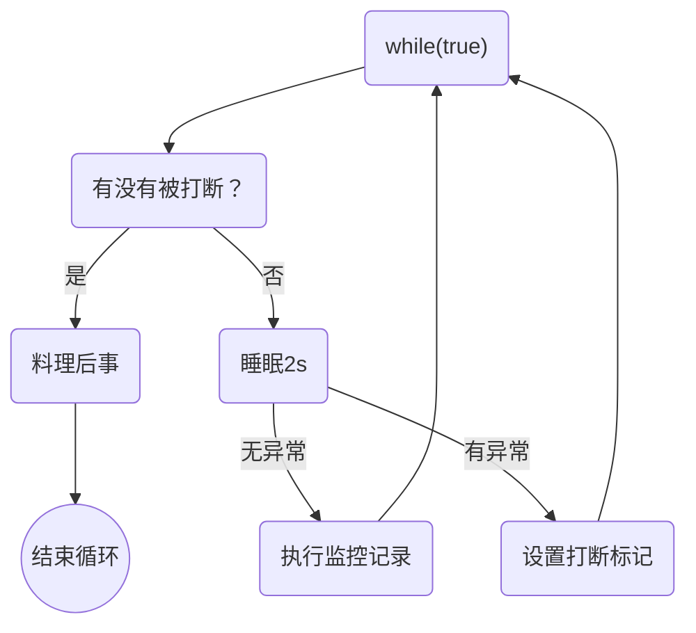

# 并发编程-模式

## 两阶段终止模式

Two Phase Termination

在一个线程 t1中如何“优雅”终止线程 t2？这里的【优雅】指得是给 t2一个处理后续的机会

### 1. 错误思路

- 使用线程对象的 stop()方法停止线程
  - stop方法会真正杀死线程，如果这时线程锁住了共享资源，那么当它被杀死后就再没有机会释放锁，其它线程将永远无法获取锁
- 使用 System.exit(int)方法停止线程
  - 目的仅是停止一个线程，但会让整个程序都停止

### 2. 两阶段终止模式

#### 示意图



#### 实现监控系统

```java
public class Test7 {
  public static void main(String[] args) throws InterruptedException {
    TwoPhaseTermination tpt = new TwoPhaseTermination();
    tpt.start();
    Thread.sleep(1000);
    tpt.stop();
  }
}

class TwoPhaseTermination {
  private Thread monitor;
  
  // 启动监控线程
  public void start() {
    monitor = new Thread(() -> {
      Thread current = Thread.currentThread();
      if (current.isInterrputed()) {
        System.out.println("料理后事");
      }
      try {
        Thread.sleep(2000); // 可能被打断的情况一
        System.out.println("执行监控记录"); // 可能被打断的情况二
      } catch (InterruptedException e) {
        e.printStackTrace();
        current.interrupt(); // sleep状态被打断，会被清除打断标记，需要重新设置打断标记
      }
    })；
      
    monitor.start();
  }
  
  // 停止监控线程
  public void stop() {
    monitor.interrupt();
  }
}
```

