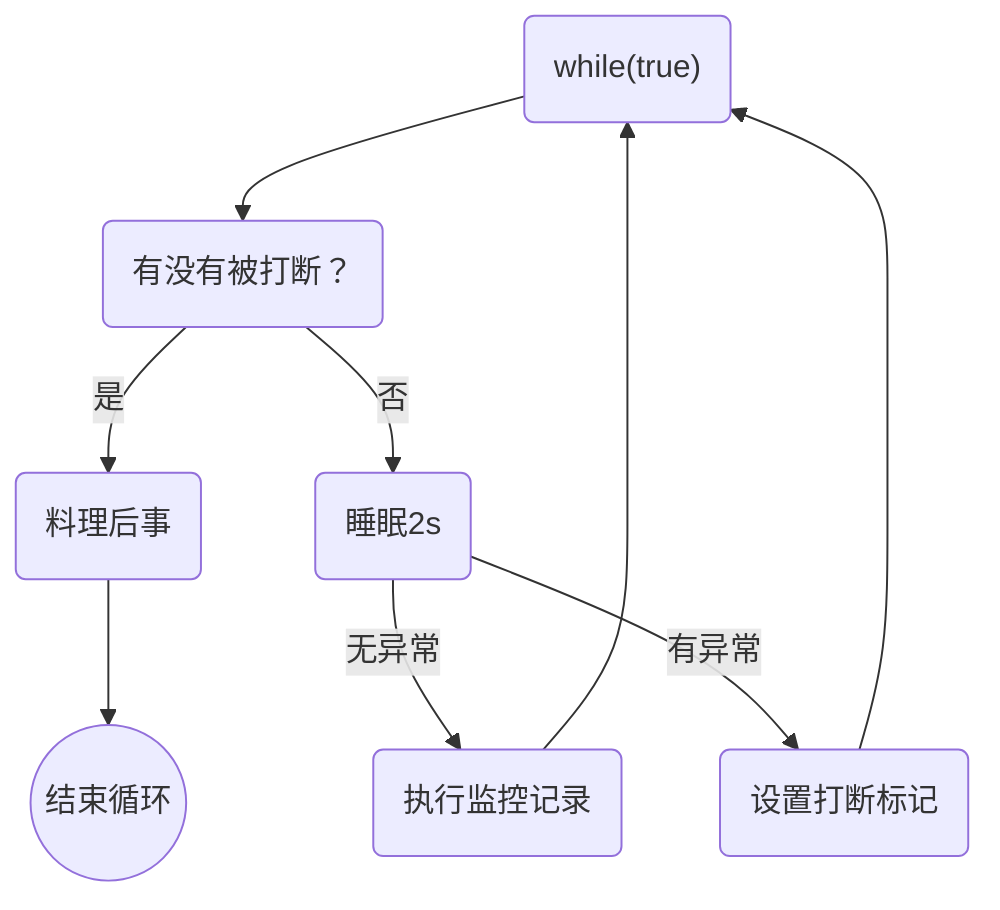

# 并发编程-模式

## 两阶段终止模式

Two Phase Termination

在一个线程 t1中如何“优雅”终止线程 t2？这里的【优雅】指得是给 t2一个处理后续的机会

### 1. 错误思路

- 使用线程对象的 stop()方法停止线程
  - stop方法会真正杀死线程，如果这时线程锁住了共享资源，那么当它被杀死后就再没有机会释放锁，其它线程将永远无法获取锁
- 使用 System.exit(int)方法停止线程
  - 目的仅是停止一个线程，但会让整个程序都停止

### 2. 两阶段终止模式

#### 示意图



#### 实现监控系统

```java
public class Test7 {
  public static void main(String[] args) throws InterruptedException {
    TwoPhaseTermination tpt = new TwoPhaseTermination();
    tpt.start();
    Thread.sleep(1000);
    tpt.stop();
  }
}

class TwoPhaseTermination {
  private Thread monitor;
  
  // 启动监控线程
  public void start() {
    monitor = new Thread(() -> {
      Thread current = Thread.currentThread();
      if (current.isInterrputed()) {
        System.out.println("料理后事");
      }
      try {
        Thread.sleep(2000); // 可能被打断的情况一
        System.out.println("执行监控记录"); // 可能被打断的情况二
      } catch (InterruptedException e) {
        e.printStackTrace();
        current.interrupt(); // sleep状态被打断，会被清除打断标记，需要重新设置打断标记
      }
    })；
      
    monitor.start();
  }
  
  // 停止监控线程
  public void stop() {
    monitor.interrupt();
  }
}
```

## 同步模式之保护性暂停

### 定义

即 Guarded Suspension，用在一个线程等待另一个线程的执行结果

要点

- 有一个结果需要从一个线程传递到另一个线程，让它们关联到同一个 GuardedObject
- 如果有结果不断从一个线程到另一个线程，那么可以使用消息队列（见生产者/消费者）
- jdk中，join的实现，Future的实现，采用的就是此模式
- 因为要等待另一方的结果，因此归类到同步模式


### 实现

```java
public class Test {
  public static void main(String[] args) {
    GuardedObject obj = new GuardedObject();
    new Thread(() -> {
      System.out.println("等待结果");
      List<String> list = (List<String>) obj.get();
      System.out.println("结果大小: {}".format(list.size()));
    }, "t1").start();
    
    new Thread(() -> {
      System.out.println("执行下载");
      try {
        List<String> list = Downloader.download();
        obj.complete(list);
      } catch(IOExceptipn e) {
				e. printStackTrace(e);
      }
    }, "t2").start();
  }
}

class GuardedObject {
  // 结果
  private Object response;
  
  // 获取结果
  public Object get() {
    synchronized(this) {
      // 没有结果
      while(response == null) {
        try {
          this.wait();
        } catch (InterruptedException e) {
          e.printStackTrace();
        }
      }
      return response;
    }
  }
  
 	// 产生结果
  public void complete(Object response) {
    synchronized(this) {
      // 给结果成员变量赋值
      this.response = response;
      this.notifyAll();
    }
  }
}
```

### 超时效果实现

```java
class GuardedObject {
	private Object response;
  
  // timeout - 需要等待的总时间
  public Object get(long timeout) {
    synchronized(this) {
      // 1. 开始计时
      long begin = System.currentTimeMillis();
      // 2-1. 经过的时间
			long passedTime = 0L;
      while(response == null) {
        // 3. 还需要等待的时间
        long waitTime = timeout - passedTime;
        if (waitTime <= 0) {
          break;
        }
       	try {
          this.wait(waitTime);
        } catch (InterruptedException e) {
          e.printStackTrace();
        }
        // 2-2. 已经执行了多久
        passedTime = System.currentTimeMillis() - begin;
      }
      return response;
    }
  }
}
```

### *原理之 join


### 拓展

图中 Futures就好比居民楼一层的信箱（每个信箱有房间编号），左侧的 t0，t1，t4就好比等待邮件的居民，右侧的 t1，t3，t5就好比邮递员

如果需要在多个类之间使用 GuardedObject对象，作为参数传递不是很方便，因此设计一个用来解耦的中间类，这样不仅能够解耦【结果等待者】和【结果生产者】，还能够同时支持多个任务的管理


实现：

```java
public class Test {
	public static void main(String[] args) throws InterruptedException {
    for (int i = 0; i < 3; i++) {
      new People().start();
    }
    
    Thread.sleep(1000);
    for (Integer id : Mailboxes.getIds()) {
      new Postman(id, "内容" + id).start();
    }
  }
}

class People extends Thread {
  @Override
  public void run() {
    // 收信
    GuardedObject obj = Mailboxes.createGuardedObject();
    System.out.println("开始收信, id: {}".format(obj.getId()));
    Object mail = obj.get(5000);
    System.out.println("收到信, id: {}, 内容: {}".format(obj.getId(), mail));
  }
}

class Postman extends Thread {
  private int id;
  private String mail;
  
  public Postman(int id, String mail) {
    this.id = id;
    this.mail = mail;
  }

  @Override
  public void run() {
    // 收信
    GuardedObject obj = Mailboxes.getGuardedObject(id);
    System.out.println("送信, id: {}, 内容: {}".format(obj.getId(), mail));
    Object mail = obj.complete(mail);
  }
}

class Mailboxes {
  private static Map<Integer, GuardedObject> boxes = new Hashtable<>();

  private static int id = 1;

  // 产生唯一 id
  private static synchronized int generateId() {
    return id++;
  }

  public static GuardedObject getGuardedObject(int id) {
    return boxes.remove(id);
  }

  public static GuardedObject createGuardedObject() {
    GuardedObject obj = new GuardedObject(generateId());
    boxes.put(obj.getId(), obj);
    return obj;
  }

  public static Set<Integer> getIds() {
    return boxes.keySet();
  }
}

class GuardedObject {
  private int id;

	private Object response;
  
  public void GuardedObject(int id) {
    this.id = id;
	}
  
  public int getId() {
    return this.id;
  }
  
  // timeout - 需要等待的总时间
  public Object get(long timeout) {
    synchronized(this) {
      // 1. 开始计时
      long begin = System.currentTimeMillis();
      // 2-1. 经过的时间
			long passedTime = 0L;
      while(response == null) {
        // 3. 还需要等待的时间
        long waitTime = timeout - passedTime;
        if (waitTime <= 0) {
          break;
        }
       	try {
          this.wait(waitTime);
        } catch (InterruptedException e) {
          e.printStackTrace();
        }
        // 2-2. 已经执行了多久
        passedTime = System.currentTimeMillis() - begin;
      }
      return response;
    }
  }

 	// 产生结果
  public void complete(Object response) {
    synchronized(this) {
      // 给结果成员变量赋值
      this.response = response;
      this.notifyAll();
    }
  }
}
```

## 异步模式之生产者/消费者

### 定义

要点

- 与前面的保护性暂停中的 GuardedObject不同，不需要产生结果和消费结果的线程一一对应
- 消费者队列可以用来平衡生产和消费的线程资源
- 生产者仅负责产生结果数据，不关心数据该如何处理，而消费者专心处理结果数据
- 消费队列是有容量限制的，满时不会再加入数据，空时不会再消耗数据
- jdk中各种阻塞队列，采用的就是这种模式


### 实现

```java
public class Test {
  public static void main(String[] args) {
    MessageQueue queue = new MessageQueue(2);
 
    for (int i = 0; i < 3; i++) {
      int id = i;
      new Thread(() -> {
        queue.put(new Message(id, "值" + id));
      }, "生产者" + i).start();
    }
    
    new Thread(() -> {
      while(true) {
        sleep(1);
        Message message = queue.take();
      }
    }, "消费者").start();
  }
}

// java线程之间通信，消息队列类
class MessageQueue {
  // 消息的队列集合
  private LinkedList<Message> list = new LinkedList<>();
  // 队列容量
  private int capcity;
  
  public MessageQueue(int capcity) {
    this.capcity = capcity;
  }
  
  // 获取消息
  public Message take() {
    // 检查对象是否为空
    synchronized(list) {
      while(list.isEmpty()) {
        try {
          System.out.println("队列为空，消费者线程等待")
          list.wait();
        } catch (InterruptedException e) {
          e.printStackTrace();
        }
      }
      // 从队列头部获取消息并返回
      Message message = list.removeFirst();
      System.out.println("已消费消息: {}".format(message));
      list.notifyAll();
      return message;
    }
  }
  
  // 存入消息
 	public void put(Message message) {
    synchronized(list) {
      while(list.size() == capcity) {
        try {
          System.out.println("队列已满，生产者线程等待")
          list.wait();
        } catch (InterruptedException e) {
          e.printStackTrace();
        }
      }
      // 将消息加入队列尾部
      list.addLast(message);
      System.out.println("已生产消息: {}".format(message));
      list.notifyAll();
    }
  }
}

final class Message {
  private int id;
  private Object value;
  
  public Message(int id, Object vlaue) {
    this.id = id;
    this.value = vlaue;
  }
  
  public int getId() {
    return id;
  }
  
  public Object getValue() {
    return value;
  }
  
  @Override
  public String toString() {
    return "Message{" +
      			"id=" + id +
      			", value" + value +
      			'}';
  }
}
```

